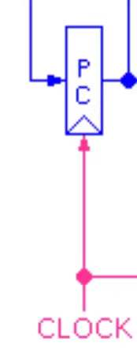

# 第一部分：基本部件的设计


## (一)设计说明

如下图所示，本次PJ基本参照文档*`数字部件设计Project.doc`*的图示进行构造，分析PJ要求的几种指令实现，对于文档图示进行了相应的简化。


- 去掉了控制单元中**BRANCH**、**SHIFT**的输出以及以这两个控制信号为判断条件的选择器。
- ALU单元中加入了**overflow**的输出，去掉了**zero**的输出。

## (二)基本部件的实现

### 1.程序计数器



```verilog
//基本部件: 程序计数器
/*(1)部件功能说明: 输入的值nextPC是下一周期的PC，用于更新PC。
(2)部件设计思路: 本模块仅需要进行赋值，利用always语句通过时钟信号进行触发（另加了reset功能）。
(3)部件会在单周期CPU的哪些地方能够用到: 获得一个周期操作的指令地址。
*/
module ProgramCounter #(parameter WIDTH = 32) (
    input clk, rst,
    input [WIDTH - 1 : 0] nextPC,
    output reg[WIDTH - 1 : 0] PC
);
    always @(posedge clk, posedge rst) begin
        if (rst) PC <= 0;
        else PC <= nextPC;
    end
endmodule
```


### 2.指令存储单元


```verilog
//基本部件: 指令存储单元
/*(1)部件功能说明: 利用存储的指令，将输入的指令地址进行分析，得到rs、rt等指令信息。
(2)部件设计思路: 截取PC有效位，在指令RAM中找到对应指令，再将指令截取成不同信息输出。
(3)部件会在单周期CPU的哪些地方能够用到: 利用PC得到各种指令信息。
*/
module InstMem (
    input [31 : 0] PC,
    output [5 : 0] op,
    output [4 : 0] rs, 
    output [4 : 0] rt,
    output [4 : 0] rd,
    output [25 : 0] address,
    output [15 : 0] imm,
    output [5 : 0] func
);
    wire [31 : 0] RAM[0 : 15];

    //初始化
    assign RAM[0] = 32'h00000000;
    assign RAM[1] = 32'h20010008;   //addi
	assign RAM[2] = 32'h3402000c;   //ori
	assign RAM[3] = 32'h3049000a;   //andi
	assign RAM[4] = 32'h282a000c;   //slti 
    assign RAM[5] = 32'h00221820;   //add
    assign RAM[6] = 32'h00412022;   //sub
    assign RAM[7] = 32'h00222824;   //and 
	assign RAM[8] = 32'h00223025;   //or 
    assign RAM[9] = 32'h0022382a;   //slt 
    assign RAM[10] = 32'hac220004;   //sw 
    assign RAM[11] = 32'h8c280004;   //lw 
    assign RAM[12] = 32'h00000000;   //nop
    assign RAM[13] = 32'h0800000f;   //jump
    assign RAM[14] = 32'h00000000;   
    assign RAM[15] = 32'h00000000;   

    wire [3 : 0] PC_use;
    assign PC_use = PC[5 : 2];
    
    assign op = RAM[PC_use][31 : 26];
    assign rs = RAM[PC_use][25 : 21];
    assign rt = RAM[PC_use][20 : 16];
    assign rd = RAM[PC_use][15 : 11];
    assign address = RAM[PC_use][25 : 0];
    assign imm = RAM[PC_use][15 : 0];
    assign func = RAM[PC_use][5 : 0];

endmodule
```

指令表如下：（指令参考[CSDN](https://blog.csdn.net/zhaokx3/article/details/51493842)）

| RAM[] |   **汇编程序**   |   op   |  rs   |  rt   |        imm(16) / addr(26)        |  16进制   | result |
| :---: | :--------------: | :----: | :---: | :---: | :------------------------------: | :-------: | :----: |
|   0   |                  |        |       |       |                                  | 0000_0000 |        |
|   1   |  addi \$1,\$0,8  | 001000 | 00000 | 00001 |       0000_0000 _0000_1000       | 20010008  |   8    |
|   2   |  ori \$2,\$0,12  | 001101 | 00000 | 00010 |       0000_0000_0000_1100        | 3402000c  |   c    |
|   3   | andi \$9,\$2,10  | 001100 | 00010 | 01001 |       0000_0000_0000_1010        | 3049000a  |   8    |
|   4   | slti \$10,\$1,12 | 001010 | 00001 | 01010 |       0000_0000_0000_1100        | 282a000c  |   1    |
|   5   | add \$3,\$1,\$2  | 000000 | 00001 | 00010 |        00011_00000_100000        | 00221820  |   14   |
|   6   | sub \$4,\$2,\$1  | 000000 | 00010 | 00001 |        00100_00000_100010        | 00412022  |   4    |
|   7   | and \$5,\$1,\$2  | 000000 | 00001 | 00010 |        00101_00000_100100        | 00222824  |   8    |
|   8   |  or \$6,\$1,\$2  | 000000 | 00001 | 00010 |        00110_00000_100101        | 00223025  |   c    |
|   9   | slt \$7,\$1,\$2  | 000000 | 00001 | 00010 |        00111_00000_101010        | 0022382a  |   1    |
|  10   |  sw \$2,4(\$1)   | 101011 | 00001 | 00010 |       0000_0000_0000_0100        | ac220004  |  3, c  |
|  11   |   lw \$8,4($1)   | 100011 | 00001 | 01000 |       0000_0000_0000_0100        | 8c280004  |   c    |
|  12   |       nop        |        |       |       |                                  | 0000_0000 |        |
|  13   |       jump       | 000010 |       |       | 00_0000_0000_0000_0000_0000_1111 | 0800000f  |   f    |


### 3.寄存器单元


```verilog
//基本部件: 寄存器单元
/*(1)部件功能说明: 输出寄存器中地址N1、N2对应的值Q1、Q2；在写入使能WE有效时，执行写入操作。
(2)部件设计思路: 利用assign输出Q1、Q2；在时钟下降沿通过if进行条件判断，进而进行写入赋值操作（另加了reset功能）
(3)部件会在单周期CPU的哪些地方能够用到: 在执行寄存器的读取、写入中使用。
*/
module RegFile (
    input clk, rst, WE,
    input [4 : 0] N1,
    input [4 : 0] N2,
    input [4 : 0] ND,
    input [31 : 0] DI,
    output [31 : 0] Q1,
    output [31 : 0] Q2
); 
    reg [31 : 0] regfile[0 : 31];
    assign Q1 = (N1 != 0) ? regfile[N1] : 0;
    assign Q2 = (N2 != 0) ? regfile[N2] : 0;

    integer i;
    always @(negedge clk) begin
        if (rst) for (i = 0; i < 32; i = i + 1) regfile[i] <= 0;
        else if (WE && ND) regfile[ND] <= DI;
    end
endmodule

```


### 4.ALU运算单元


```verilog
//基本部件: ALU运算单元
/*(1)部件功能说明: 对输入的a、b根据操作码的不同，输出不同的运算结果，对运算的溢出情况进行判断。
(2)部件设计思路: 利用case对于不同的操作码执行不同操作，根据对支持指令的要求，ALU运算包括有符号的加减、无符号的加、与、或、小于。
(3)部件会在单周期CPU的哪些地方能够用到: 根据指令信息进行ALU运算。
*/
module ALU (
    input [31 : 0] a,
    input [31 : 0] b,
    input [2 : 0] alucont,
    output reg [31 : 0] result,
    output reg overflow
);
    reg [32:0] sum;
    reg [32:0] sub;
    always @(*) begin
        case (alucont)
            //加（判断溢出）
            3'b000: begin
                result = a + b;
                sum = {a[31], a[31 : 0]} + {b[31], b[31 : 0]};
                if (sum[31] == sum[32]) overflow = 1'b0;
                else overflow = 1'b1;
            end
            //减（判断溢出）
            3'b001: begin
                result = a - b;
                sub = {a[31], a[31 : 0]} - {b[31], b[31 : 0]};
                if (sub[31] == sub[32]) overflow = 1'b0;
                else overflow = 1'b1;
            end
            //加（不判断溢出）
            3'b010: begin
                result = a + b;
                overflow = 1'b0;
            end
            //与
            3'b011: begin
                result = a & b;
                overflow = 1'b0;
            end
            //或
            3'b100: begin
                result = a | b;
                overflow = 1'b0;
            end
            //小于
            3'b101: begin
                if (a < b) result = 32'h00000001;
                else result = 32'h00000000;
                overflow = 1'b0;
            end
        endcase
    end
endmodule
```


### 5.数据存储单元


$$

$$

```verilog
//基本部件: 数据存储单元
/*(1)部件功能说明: 进行数据的读取和写入。
(2)部件设计思路: 利用assign输出rd；在时钟下降沿通过if进行条件判断，进而进行写入赋值操作（另加了reset功能）
(3)部件会在单周期CPU的哪些地方能够用到: 在CPU中用于对此数据存储单元的操作。
*/
module DataMemory (
    input clk, rst, WE,
    input [31 : 0] address, wd,
    output [31 : 0] rd
);
    reg [31 : 0] date_mem[0 : 63];
    wire [5 : 0] address_use;
    assign address_use = address[7 : 2];
    assign rd = date_mem[address_use];

    integer i;
    always@(negedge clk) begin
        if (rst) for(i = 0; i < 64; i = i + 1) date_mem[i] <= 0;
        else if (WE) date_mem[address_use] <= wd;
    end
endmodule

```


### 6.立即数扩展单元


```verilog
//基本部件: 立即数扩展单元
/*(1)部件功能说明: 将16bit的立即数补为32bit，分为sign_extend和zero_extend两种。
(2)部件设计思路: 利用？:运算符，借助select判断扩展类型，并进行相应操作。
(3)部件会在单周期CPU的哪些地方能够用到: 将立即数进行位宽拓展方便进行之后的运算等。
*/
module Ext (
    input select,
    input [15:0] imm,
    output [31:0] extend_i
);
    assign extend_i[15:0] = imm;
    assign extend_i[31:16] = select ? (imm[15] ? 16'hffff : 16'h0000) : 16'h0000;
endmodule
```


### 7.选择器

在设计的CPU中，选择器选择数据的位宽有32位和5位两种。


```verilog
//基本部件: 选择器
/*(1)部件功能说明: 在a、b两个数据中进行选择。
(2)部件设计思路: 利用?:运算符，借助select进行数据的选择。
(3)部件会在单周期CPU的哪些地方能够用到: ALU中输入B的选择、下一个PC值的选择、写入寄存器数据的选择、写入地址ND的选择。
*/
module MUX_32 (
    input select,
    input [31 : 0] a,
    input [31 : 0] b,
    output [31 : 0] result
);
    assign result = select ? a : b;
endmodule
module MUX_5 (
    input select,
    input [4 : 0] a,
    input [4 : 0] b,
    output [4 : 0] result
);
    assign result = select ? a : b;
endmodule
```


### 8.无符号加法器


```verilog
//基本部件: 无符号加法器
/*(1)部件功能说明: 输出a、b的和。
(2)部件设计思路: 直接利用运算符输出结果。
(3)部件会在单周期CPU的哪些地方能够用到: 计算PC + 4。
*/
module Adder (
    input [31 : 0] a,
    input [31 : 0] b,
    output [31 : 0] sum
);
    assign sum = a + b;
endmodule
```


### 9.左移器


```verilog
//基本部件: 左移器
/*(1)部件功能说明: 将数值a左移两位。
(2)部件设计思路: 利用assign直接输出结果。
(3)部件会在单周期CPU的哪些地方能够用到: jump指令时对address的操作。
*/
module SL2 (
    input [25 : 0] a,
    output [27 : 0] y
);
    assign y = {a, 2'b00};
endmodule
```


## (三)基本部件的仿真

### 1.程序计数器

仿真代码为：

```verilog
`timescale 1ns / 1ps


module t_ProgramCounter();
    reg clk, rst;
    wire [31 : 0] nextPC;
    wire [31 : 0] PC;
    ProgramCounter pc(clk, rst, nextPC, PC);
    assign nextPC = PC + 4;

    always #10 clk = ~clk;

    initial #1000 $finish;
    initial begin
        clk = 0;
        rst = 1;

        #20 rst = 0;
    end
endmodule
```

仿真波形图：


波形图开始，PC在rst下进行置0；设置`nextPC = PC + 4;`，nextPC始终是PC + 4，而PC在时钟上升沿通过nextPC进行更新。故部件设计正确。

### 2.指令存储单元

仿真代码为：

```verilog
`timescale 1ns / 1ps


module t_InstMem();
    reg [31 : 0] PC;
    wire [5 : 0] op;
    wire [4 : 0] rs; 
    wire [4 : 0] rt;
    wire [4 : 0] rd;
    wire [25 : 0] address;
    wire [15 : 0] imm;
    wire [5 : 0] func;
    InstMem instmem(PC, op, rs, rt, rd, address, imm, func);
    always #10 PC = PC + 4; 
    initial begin
        PC = 0;
    end
endmodule
```

仿真波形图：


此部件输出都是由PC得到的指令的截取，在部件设计时，已经为RAM进行了赋值操作，我们可以在波形图中逐个进行比较，比如`PC = 0000_0004`时，所取指令为RAM[1] = 32’b0010_0000_0000_0001_0000_0000_0000_1000(见上方表格)，则有op=001000, rs=00000, rt=0_0001, rd=00000, address=00_0000_0001_0000_0000_0000_1000, imm=0000_0000_0000_1000, func=00_1000, 转化成十六进制恰与图示相等，同样地，其他PC也满足此性质；另一方面，由于RAM的个数原因，当`PC=0000_0044`时，所取指令重新变为RAM[1]。综上，逐个比较可得，部件设计正确。

### 3.寄存器单元

仿真代码为：

```verilog
`timescale 1ns / 1ps


module t_RegFile();
    reg clk, rst, WE;
    reg [4 : 0] N1;
    reg [4 : 0] N2;
    reg [4 : 0] ND;
    reg [31 : 0] DI;
    wire [31 : 0] Q1;
    wire [31 : 0] Q2;
    RegFile regfile(clk, rst, WE, N1, N2, ND, DI, Q1, Q2);
    always #10 clk = ~clk;
    initial begin
        clk = 0; rst = 1; WE = 0; N1 = 5'b00000; N2 = 5'b00000; 
        #20 rst = 0; 
        #20 ND = 5'b10101; DI = 32'hffffffff;
        #20 WE = 1;
        #20 N1 = 5'b10101; 
    end
endmodule
```

仿真波形图：


此部件为寄存器的存取，在仿真时，通过rst使寄存器置0，之后令确定ND、DI的值，使WE为1，期望将DI写入地址为ND的寄存器中，之后令N1值取ND，Q1的值从0变到了DI，同时说明了寄存器的存取功能。故部件设计正确。

### 4.ALU运算单元

仿真代码为：

```verilog
`timescale 1ns / 1ps


module t_ALU();
    reg [31 : 0] a;
    reg [31 : 0] b;
    reg [2 : 0] alucont;
    wire [31 : 0] result;
    wire overflow;
    ALU alu(a, b, alucont, result, overflow);
    
    initial #100 $finish;
    initial begin
        a = 32'h7fff_fff0;
        b = 32'h7fff_fff0;
        alucont = 3'b000;        //add
        #10 alucont = 3'b010;    //addu
        #10 alucont = 3'b001;    //sub
        #10 b = 32'h8fff_fff0;
        #10 b = 32'h0101_0101;
        #10 alucont = 3'b011;    //and
        #10 alucont = 3'b100;    //or
        #10 alucont = 3'b101;    //less than
        #10 b = 32'h8fff_fff0;
    end
endmodule
```

仿真波形图：


仿真依次测试add、addu、sub、and、or、less than，中间通过改变b的值来测试overflow等，观测到的结果一方面result始终等于a、b在相应操作下的结果，另一方面在开始的加法以及改变b值的减法中，均有overflow变为1。故部件设计正确。

### 5.数据存储单元

仿真代码为：

```verilog
`timescale 1ns / 1ps


module t_DataMemory();
    reg clk, rst, WE;
    reg [31 : 0] address, wd;
    wire [31 : 0] rd;
    DataMemory datamemory(clk, rst, WE, address, wd, rd);
    always #10 clk = ~clk;
    initial begin
        clk = 0; rst = 1; WE = 0;
        address = 32'h0000_0000; wd = 32'hffff_ffff;
        #20 rst = 0; WE = 1;
    end
endmodule
```

仿真波形图：


该部件需测试数据存储单元的存取，开始利用rst置0，确定地址和写入值后，令WE为0，波形图中rd值从0000_0000到ffff_ffff的变化充分证明了该部件的功能，部件设计正确。

### 6.立即数扩展单元

仿真代码为：

```verilog
`timescale 1ns / 1ps


module t_Ext();
    reg select;
    reg [15:0] imm;
    wire [31:0] extend_i;
    Ext ext(select, imm, extend_i);
    initial begin
        imm = 16'hf0f0; select = 0;
        #10 select = 1;
    end
endmodule
```

仿真波形图：


select从0到1时，extend_i的值证明了该部件设计正确。

### 7.选择器

仿真代码为：

```verilog
`timescale 1ns / 1ps


module t_MUX_5();
    reg select;
    reg [4 : 0] a;
    reg [4 : 0] b;
    wire [4 : 0] result;
    MUX_5 mux_5(select, a, b, result);

    initial begin
        a = 5'b01010; b = 5'b11111;
        select = 0;
        #10 select = 1;
    end
endmodule
```

仿真波形图：


由于两种选择器性质相同，故使用`MUX_5`进行仿真，确定a、b的值，result随select的变化证明了该部件设计正确。

### 8.无符号加法器

仿真代码为：

```verilog
`timescale 1ns / 1ps


module t_Adder();
    reg [31 : 0] a;
    reg [31 : 0] b;
    wire [31 : 0] sum;

    Adder adder(a, b, sum);

    initial #100 $finish;
    initial begin
        a = 1; b = 1;
        forever #10 a = a + 1;
    end
endmodule
```

仿真波形图：


sum始终为a+b，易知部件设计正确。

### 9.左移器

仿真代码为：

```verilog
`timescale 1ns / 1ps


module t_SL2();
    reg [25 : 0] a;
    wire [27 : 0] y;
    SL2 sl2(a, y);

    initial begin
        a = 26'b11_1111_1111_1111_1111_1111_1111;
        #10 a = 26'b11_1111_1111_1111_1111_0000_1111;
    end
endmodule
```

仿真波形图：


该部件实现简单，由波形图，从a到y正好是左移两位的结果，所以该部件设计正确。
