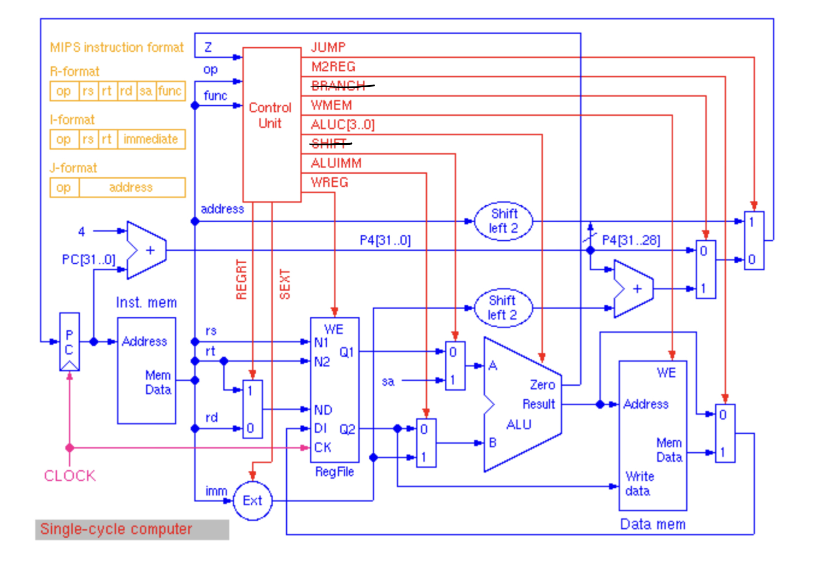
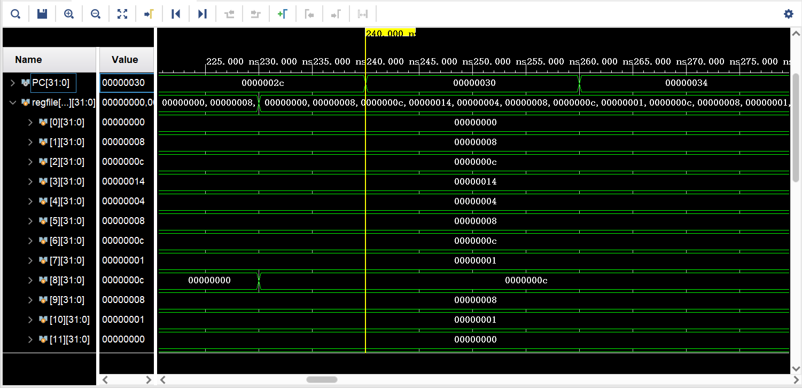

# 第二部分：CPU成品

## (一)设计说明

### 1.设计图

如第一部分所说，设计图如下：



- 去掉了控制单元中**BRANCH**的输出以及以这个控制信号为判断条件的选择器。

- ALU单元中加入了**overflow**的输出，去掉了**zero**的输出。

  

### 2.功能介绍

#### 实现的功能

此工程一共可以实现15个指令，依次为：                                                                                          **add**，**sub**，**and**，**or**，**slt**，**addi**，**andi**，**ori**，**slti**，**sw**，**lw**，**j**，**nop**（文档要求的13个指令）, **addu**, **addiu**

其中，**addiu**为加立即数且不检测溢出，**addu**为加寄存器且不检测溢出。

#### 如何实现功能

##### CPU的构成

结合第一部分所说，对于整个CPU的构建，首先构造出各个基本部件，分别执行不同的功能（各个基本部件的功能已经在第一部分中介绍）；之后构建控制单元，由控制单元的值决定整条电路在一次周期中需要执行哪些功能；最后构造顶级模块，将各个基本部件与控制单元相连接，构成完整的电路。如此，电路结构的完整性保证了各个功能的实现。

##### CPU的工作流程

另一方面，CPU的功能实现可以从其在一个完整周期中的行为进行描述。CPU实现功能一般分为以下几个步骤：

(1) **取指令(IF)**：根据程序计数器PC中的指令地址，从存储器中取出一条指令，同时，PC根据指令字长度自动递增产生下一条指令所需要的指令地址，但遇到“地址转移”指令时，则控制器把“转移地址”送入PC，当然得到的“地址”需要做些变换才送入PC。

(2) **指令译码(ID)**：对取指令操作中得到的指令进行分析并译码，确定这条指令需要完成的操作，从而产生相应的操作控制信号，用于驱动执行状态中的各种操作。

(3) **指令执行(EXE)**：根据指令译码得到的操作控制信号，具体地执行指令动作，然后转移到结果写回状态

(4) **存储器访问(MEM)**：所有需要访问存储器的操作都将在这个步骤中执行，该步骤给出存储器的数据地址，把数据写入到存储器中数据地址所指定的存储单元或者从存储器中得到数据地址单元中的数据。

(5) **结果写回(WB)**：指令执行的结果或者访问存储器中得到的数据写回相应的目的寄存器中。


（以上资料来源：[CSDN](https://blog.csdn.net/zhaokx3/article/details/51493842)）

如上，CPU的工作过程正是其实现功能的过程。


## (二)控制单元的实现

由上面的设计图可得所有的控制信号如下：                                                                                                      **regrt, sext, wreg, aluimm, wmem, m2reg, jump, getalu, aluop**

结合文档，得每个控制信号的含义：

- **regrt ** ：选择rt / rd

- **sext** ：符号扩展 / 0扩展

- **wreg** ： 是 / 否写入寄存器

- **aluimm** ：选择扩展的立即数 / 寄存器数据

- **wmem** ：是 / 否写入存储器

- **m2reg** ：选择存储器数据 / ALU输出数据

- **jump** ：选择跳转目标地址 / PC + 4

- **getalu** ：是 / 否已得到aluop

- **aluop** ：ALU操作符

  

对于控制单元的第一个模块MainDec，其有关量的取值可由下表得到：

|        | op     | regrt | sext | wreg | aluimm | wmem | m2reg | jump | getalu | aluop1 |
| :----: | ------ | :---: | :--: | :--: | :----: | :--: | :---: | :--: | :----: | :----: |
| R-type | 000000 |       |      |  1   |        |      |       |      |        |  000   |
|  addi  | 001000 |   1   |  1   |  1   |   1    |      |       |      |   1    |  000   |
| addiu  | 001001 |   1   |      |  1   |   1    |      |       |      |   1    |  010   |
|  andi  | 001100 |   1   |      |  1   |   1    |      |       |      |   1    |  011   |
|  ori   | 001101 |   1   |      |  1   |   1    |      |       |      |   1    |  100   |
|  slti  | 001010 |   1   |  1   |  1   |   1    |      |       |      |   1    |  101   |
|   sw   | 101011 |       |  1   |      |   1    |  1   |       |      |   1    |  010   |
|   lw   | 100011 |   1   |  1   |  1   |   1    |      |   1   |      |   1    |  010   |
|  jump  | 000010 |       |      |      |        |      |       |  1   |   1    |  000   |
|  nop   | 000000 |       |      |      |        |      |       |      |   1    |  000   |

对于控制单元的第二个模块AluDec，其有关量的取值以及与ALU模块对应关系可由下表得到：

|      |  func  | funcop | ALU operator  |
| :--: | :----: | :----: | :-----------: |
| add  | 100000 |  000   |       +       |
| sub  | 100010 |  001   |       -       |
| addu | 100001 |  010   | +(不检测溢出) |
| and  | 100100 |  011   |       &       |
|  or  | 100101 |  100   |      \|       |
| slt  | 101010 |  101   |       <       |

控制单元的实现代码：

```verilog
//控制单元
/*(1)部件功能说明: 控制基本部件功能的实现。
(2)部件设计思路: 通过设计图得出所有控制信号，将控制单元分成两个译码器部件，在MainDec中由op得到除ALUop之外的控制信号的值，在AluDec中由MainDec中得到的信息和func综合，得到ALUop。
(3)部件会在单周期CPU的哪些地方能够用到: 与其他基本部件相连，控制基本部件功能的实现。
*/
module Controller (
    input [5 : 0] op,
    input [5 : 0] func,
    output regrt, sext, wreg, aluimm, wmem, m2reg, jump, getalu,
    output [2 : 0] aluop
);
    wire [2:0] aluop1;
    MainDec md (op, regrt, sext, wreg, aluimm, wmem, m2reg, jump, getalu, aluop1);
    AluDec ad (func, getalu, aluop1, aluop);
    
endmodule

module MainDec (
    input [5 : 0] op, 
    output regrt, sext, wreg, aluimm, wmem, m2reg, jump, getalu, 
    output [2 : 0] aluop1
);
    reg [10 : 0] controls;
    assign {regrt, sext, wreg, aluimm, wmem, m2reg, jump, getalu, aluop1} = controls;

    always@(*) begin
        case (op)
            //R-type
            6'b000000 : controls = 11'b00100000_000;
            //addi
            6'b001000 : controls = 11'b11110001_000;
            //addiu
            6'b001001 : controls = 11'b10110001_010;
            //andi
            6'b001100 : controls = 11'b10110001_011;
            //ori
            6'b001101 : controls = 11'b10110001_100;
            //slti
            6'b001010 : controls = 11'b11110001_101;
            //sw
            6'b101011 : controls = 11'b01011001_010;
            //lw
            6'b100011 : controls = 11'b11110101_010;
            //jump
            6'b000010 : controls = 11'b00000011_000;
            default:  controls = 11'b000000000_000;
        endcase
    end
endmodule

module AluDec (
    input [5 : 0] func, 
    input getalu, 
    input [2 : 0] aluop1, 
    output [2 : 0] aluop
);
    reg [2 : 0] funcop;
    assign aluop = getalu ? aluop1 : funcop;
    always@(*) begin
        case (func)
            //add
            6'b100000 : funcop = 3'b000;
            //sub
            6'b100010 : funcop = 3'b001;
            //addu
            6'b100001 : funcop = 3'b010;
            //and
            6'b100100 : funcop = 3'b011;
            //or
            6'b100101 : funcop = 3'b100;
            //slt
            6'b101010 : funcop = 3'b101;
            //nop
            default:  funcop = 3'b000;
        endcase
    end
endmodule
```


## (三)CPU成品的实现

将部件进行连接，得到完整CPU：

```verilog
//CPU成品
/*(1)部件功能说明: 连接CPU所有部件。
(2)部件设计思路: 依照设计图，依次连接每个部件。
(3)部件会在单周期CPU的哪些地方能够用到: 连线其他部件，得到完整CPU。
*/
module CPU (
    input clk, pc_rst, mem_rst, reg_rst
);
    wire regrt, sext, wreg, aluimm, wmem, m2reg, jump, getalu, overflow;
    wire [31 : 0] nextPC, PC, P4, excimm, DI, q1, q2, alu2, result, data;
    wire [4 : 0] rs, rt, rd, ND;
    wire [15 : 0] imm;
    wire [5 : 0] op, func;
    wire [25 : 0] address;
    wire [27 : 0] addressl;
    wire [2 : 0] aluop;

    ProgramCounter pc(clk, pc_rst, nextPC, PC);
    InstMem instmem(PC, op, rs, rt, rd, address, imm, func);
    Controller controller(op, func, regrt, sext, wreg, aluimm, wmem, m2reg, jump, getalu, aluop);
    Ext ext(sext, imm, excimm);
    MUX_5 rt_or_rd(regrt, rt, rd, ND);
    RegFile regfile(clk, reg_rst, wreg & (~overflow), rs, rt, ND, DI, q1, q2);
    MUX_32 excimm_or_q2(aluimm, excimm, q2, alu2);
    ALU alu(q1, alu2, aluop, result, overflow);
    DataMemory mem(clk, mem_rst, wmem, result, q2, data);
    MUX_32 data_or_result(m2reg, data, result, DI);
    Adder adder(PC, 32'h00000004, P4);
    SL2 sl2(address, addressl);
    MUX_32 pcjump_or_P4(jump, {P4[31:28], addressl}, P4, nextPC);
endmodule
```


## (四)CPU的仿真

仿真代码为：

```verilog
`timescale 1ns / 1ps


module t_CPU();
    reg clk, pc_rst, mem_rst, reg_rst;
    CPU cpu(clk, pc_rst, mem_rst, reg_rst);

    always #10 clk = ~clk;
    
    initial #1000 $finish;
    initial begin
        clk = 1; pc_rst = 1; mem_rst = 1; reg_rst = 1;
        #20 pc_rst = 0; mem_rst = 0; reg_rst = 0;
    end
endmodule
```

仿真波形图：





同时结合在第一部分绘制的指令表：

| RAM[] |   **汇编程序**   |   op   |  rs   |  rt   |        imm(16) / addr(26)        |  16进制   | result |
| :---: | :--------------: | :----: | :---: | :---: | :------------------------------: | :-------: | :----: |
|   0   |                  |        |       |       |                                  | 0000_0000 |        |
|   1   |  addi \$1,\$0,8  | 001000 | 00000 | 00001 |       0000_0000 _0000_1000       | 20010008  |   8    |
|   2   |  ori \$2,\$0,12  | 001101 | 00000 | 00010 |       0000_0000_0000_1100        | 3402000c  |   c    |
|   3   | andi \$9,\$2,10  | 001100 | 00010 | 01001 |       0000_0000_0000_1010        | 3049000a  |   8    |
|   4   | slti \$10,\$1,12 | 001010 | 00001 | 01010 |       0000_0000_0000_1100        | 282a000c  |   1    |
|   5   | add \$3,\$1,\$2  | 000000 | 00001 | 00010 |        00011_00000_100000        | 00221820  |   14   |
|   6   | sub \$4,\$2,\$1  | 000000 | 00010 | 00001 |        00100_00000_100010        | 00412022  |   4    |
|   7   | and \$5,\$1,\$2  | 000000 | 00001 | 00010 |        00101_00000_100100        | 00222824  |   8    |
|   8   |  or \$6,\$1,\$2  | 000000 | 00001 | 00010 |        00110_00000_100101        | 00223025  |   c    |
|   9   | slt \$7,\$1,\$2  | 000000 | 00001 | 00010 |        00111_00000_101010        | 0022382a  |   1    |
|  10   |  sw \$2,4(\$1)   | 101011 | 00001 | 00010 |       0000_0000_0000_0100        | ac220004  |  3, c  |
|  11   |   lw \$8,4($1)   | 100011 | 00001 | 01000 |       0000_0000_0000_0100        | 8c280004  |   c    |
|  12   |       nop        |        |       |       |                                  | 0000_0000 |        |
|  13   |       jump       | 000010 |       |       | 00_0000_0000_0000_0000_0000_1111 | 0800000f  |   f    |

在第一张图中，结合指令表中的信息，观察每一个PC时某个寄存器值的变化，可以发现，其结果正如指令表中的result所示，表明了寄存器写入操作已实施，由此，即可证明出该CPU支持addi、ori、andi、slti、add、sub、and、or、slt这九个指令；在第二张图中，`data_mem[3]`的值被更改，其结果如表中标号10所示（4+reg[1]=12, 取其二进制形式的[2:5]，值为3），说明data_mem的写入操作已实施，说明CPU支持sw，同时回到第一张图，考虑接下来的lw，因为reg[8]=c，所以CPU支持lw, 在第三、四张图中，PC=0000_0030时，此周期无变化，说明CPU支持nop；在第五张图中，PC从0000_0034直接到达0000_003c，对应于指令标号15，说明jump指令实施，CPU支持jump。

综上所述，可以有仿真得到，CPU支持文档要求的13种指令。

## (五)进一步改进

### 1.CPU的指令序列输入方式

此工程指令序列的输入为利用`assign`语句在`InstMem`模块中逐个进行输入，我认为可以如PPT所示，将其改进为文件读取的形式（`$readmemh`)，从而可以实现在文件中随意地修改指令以实现`InstMem`存储指令的修改，而不用修改`cpu.v`的代码，更符合实际的需要，同时避免代码被破坏。

### 2.PC的相对寻址

依照文档要求，寻址模式中，此工程中并未实现相对寻址，但其他寻址模式在设计中都得到了支持，控制信号也得以简化。所以，我认为此工程可以增加PC的相对寻址，增加选择器，实现**beq**指令。

### 3.丰富ALU计算方式

ALU的计算方式目前只包含6种，可以通过丰富ALU的计算方式来使CPU得以实现更多的指令，比如异或、取非等；即使超过了8种运算方式，也可以通过增加aluop的位数来不断扩充运算方式。


## (六)感悟体会

结合PPT材料，以及整个设计CPU的过程，我对==**模块化方法**==设计数字系统的理解更加深刻。在本次设计中，复杂的CPU被分割成模块化的子系统，使得每个模块都完成一定的功能任务（比如ALU运算单元、寄存器单元）；而不同的模块通过数据路径和控制信号相连组成了完整的数字系统。这种模块化的设计思维可以极大地减少工作量，使构造过程更为清晰，每次只需要考虑一个小的部件，最后，通过各部件的内在联系完成整个工程。可以说，此次CPU工程得以实现，离不开具体实施前的模块划分。

在本次CPU的构造中，特别是顶层模块的构造中，我更加清晰的感受到硬件描述语言与之前学过的程序设计语言的不同之处。虽然之前就知道verilog中语句间的==**同时性**==，但也免不了受到编程语言的影响，但在顶层模块的连线过程中，我切实感受到自己是在利用各个部件拼装CPU，虽然语句表面上有先后，但我能够明显到它与编程语言的不同之处。在这里，事件发生的先后是内在的时序逻辑决定的，而非我语句排布的先后，我只是在进行“拼装”。

但另一方面，模块化的设计也让我感受到了verilog与面向对象编程在思维上的相似，二者都有着==**模块化**==的思想，设计所有”参与“的对象的类（或模块），然后将它们实例化进行组合（或拼接），这样做的意义不仅使问题更加明晰、更加易于完成，并且，极大地提高了所写代码的==**复用性**==。比如说，我在为构建CPU所写的基本部件，同样可以通过实例化用于其他的工程。

总之，此次工程让我对数字系统的设计有了更加深入的理解。
